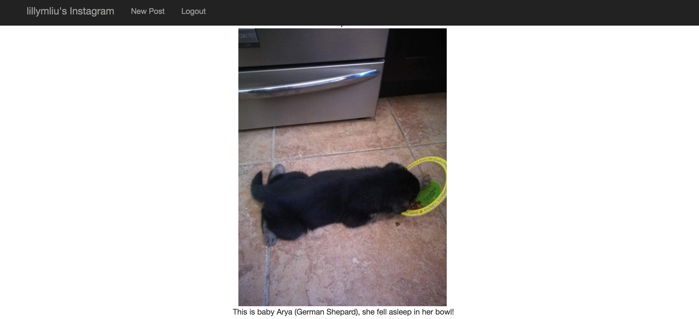
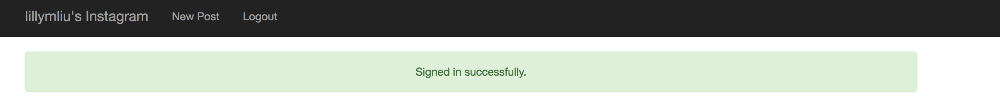
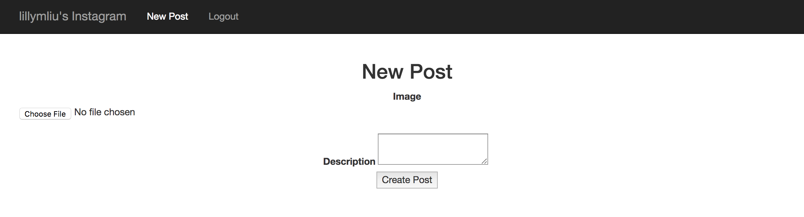

# rails-instagram

## Summary
This is assignment 1 of CS121 where the goal is to build an instagram-like site on Ruby on Rails. I followed the [tutorial found here.](https://www.youtube.com/watch?v=MpFO4Zr0EPE) THis project allows users to register, then sign in and sign out. In addition, pictures can be uploaded with descriptions and all of them will be shown on the main feed. This project requires the use of three gems: [Devise](https://github.com/plataformatec/devise) for log-in, [Bootstrap](https://github.com/twbs/bootstrap-sass ), for styling, and [Paperclip](https://github.com/thoughtbot/paperclip), for picture uploading (uses ImageMagick). This was a fun small introduction project!

## Screenshots
Here are some examples of how the site works:

This is the homepage for the site featuring an example post. The picture is centered with the description below it.

After clicking *Register* in the top bar you get sent into the sign up page. 

You will be notifed that your sign in was a success and the top bar changes so that if you are logged in - there is no option to log-in or register, but now you can log out!

If you want to log out it will first confirm that you want to. 

Once you have been registered you can then log-in with the credentials you used before.

The most important feature is the ability to add posts and you can do it in the new post tab. Here you can upload pictures and a description. 